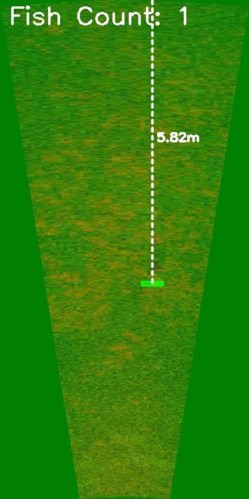
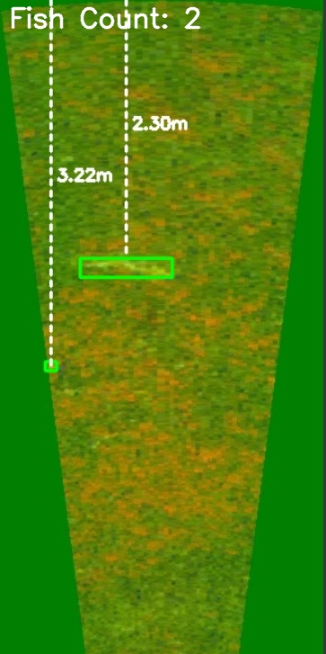

# DeepFish

A computer vision project for fish detection, counting, and depth estimation using YOLOv9s.

## Overview

DeepFish is a deep learning-based solution that can:
- Detect fish in underwater imagery
- Count the number of fish present
- Estimate the depth/distance of each fish
- Generate heatmaps showing fish distribution

The system was trained on the Caltech Fish Counting Dataset and utilizes YOLOv9s for high-accuracy detection.

## Features

- **Fish Detection**: Precise bounding box detection of fish in underwater imagery
- **Fish Counting**: Automatic enumeration of detected fish
- **Depth Estimation**: Distance calculation using pixel-to-meter conversion
- **Heatmap Visualization**: Density representation showing fish distribution
- **Annotated Output**: Visual feedback with distance measurements and counts

## Installation

```bash
# Clone the repository
git clone https://github.com/jha-adarsh18/DeepFish.git
cd DeepFish

# Create a virtual environment (optional but recommended)
python -m venv venv
source venv/bin/activate  # On Windows: venv\Scripts\activate

# Install dependencies
pip install -r requirements.txt
```

## Usage

1. Place your trained model in the `models` directory
2. Run the detection script:

```bash
python detect.py --image path/to/your/image.jpg --model models/DeepFish.pt
```

For real-time processing with a camera feed:

```bash
python detect_video.py --source 0 --model models/DeepFish.pt
```

## Model Training

The model was trained using YOLOv9s on the Caltech Fish Counting Dataset. Training details can be found in the `training` directory.

```bash
# Example training command
python train.py --data data/fishcounting.yaml --cfg models/yolov9s.yaml --batch 16 --epochs 100
```

## Results




## Dependencies

- Python 3.8+
- OpenCV
- NumPy
- Ultralytics YOLO
- Matplotlib
- PyTorch

## License

This project is licensed under the MIT License - see the LICENSE file for details.

## Acknowledgments

- [Caltech Fish Counting Dataset](https://github.com/visipedia/caltech-fish-counting)
- [Ultralytics YOLO](https://github.com/ultralytics/ultralytics)
